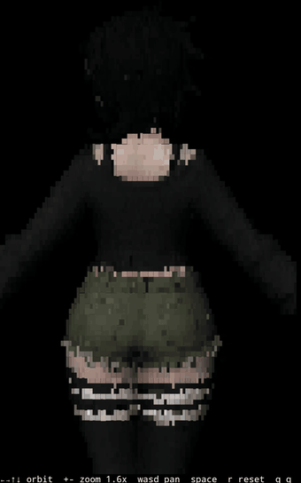

# objview

A 3D model viewer that runs **inside your termux**.

<p align="center">
  
</p>

## Install

```sh
pip install numpy pillow
python3 objview.py models/cube.obj
```

On Termux, prefer the packaged build of numpy:

```sh
pkg install python-numpy
pip install pillow
```


## Usage

```sh
python3 objview.py <model.obj|model.glb> [text] [hq]
```

| Key | Action |
| --- | --- |
| `←` `→` | Orbit (also stops the automatic turntable) |
| `↑` `↓` | Pitch |
| `+` `-` or `i` `o` | Zoom, 0.25x to 60x |
| `w` `a` `s` `d` | Pan |
| `space` | Toggle auto-rotation |
| `r` | Reset camera |
| `q` | Quit |

Pass `text` for ASCII mode, which trades the block glyphs for a density ramp
(`" .:-=+abo*#%@"`) at one character per cell.

Pass `hq` to supersample 2x and average back down. Edges stop crawling and colors blend
properly, at roughly half the frame rate.

Resolution is your terminal's cell count, so a smaller font means a sharper picture.


## License

MIT. See [LICENSE](LICENSE).
