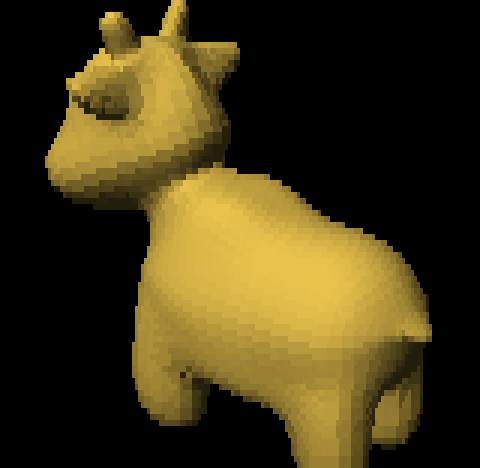

# objview

A 3D model viewer that runs **inside your termux**. No browser, no OpenGL, no window
manager — it reads an OBJ or GLB file, rasterizes it in software, and paints the result
with Unicode quadrant blocks and truecolor ANSI escapes.

<p align="center">
  
</p>

Runs at 30 fps on a phone.

## Install

```sh
pip install numpy pillow
python3 objview.py models/cube.obj
```

On Termux, prefer the packaged build of numpy:

```sh
pkg install python-numpy
pip install pillow
```

Pillow is only needed for GLB texture sampling; OBJ files load without it.

## Usage

```sh
python3 objview.py <model.obj|model.glb> [text]
```

| Key | Action |
| --- | --- |
| `←` `→` | Orbit (also stops the automatic turntable) |
| `↑` `↓` | Pitch |
| `+` `-` or `i` `o` | Zoom, 0.25x to 60x |
| `w` `a` `s` `d` | Pan |
| `space` | Toggle auto-rotation |
| `r` | Reset camera |
| `q` | Quit |

Pass `text` as a second argument for ASCII mode, which trades the block glyphs for a
density ramp (`" .:-=+abo*#%@"`) at one character per cell.

Resolution is your terminal's cell count, so a smaller font means a sharper picture.

## How it works

**Pixels.** Each terminal cell carries a 2x2 pixel block chosen from the 16 quadrant
glyphs (`▘▝▀▖▌▞▛▗▚▐▜▄▙▟█`). ANSI only gives two colors per cell, so the four pixels are
split at their midpoint luminance and each half is averaged into the foreground and
background color.

**Rasterizer.** Pure NumPy, no z-buffer. Triangles are transformed, backface-culled and
lit in one vectorized pass. Most triangles land on a single pixel and are scattered with
one fancy-index assignment; the rest have their bounding boxes flattened into a single
candidate-pixel list via `np.repeat` plus a cumulative-sum offset, so the edge tests stay
vectorized too. Depth is resolved by a single `argsort` — painter's order, nearest write
lands last.

**Normals** are computed once in model space. Each frame counter-rotates the eye and the
light instead, so there is no per-triangle cross product in the hot loop.

**Framing** is derived from the turntable's real extent rather than a bounding sphere.
Since the rotation sweeps x and z through each other, the widest the model ever gets is
its radius in that plane; height is independent. A tall thin figure therefore fills the
frame instead of wasting it.

**Zoom** scales the projection rather than moving the eye, so close-ups never warp.

**Decimation.** Vertices are welded onto a fixed 256-cell grid at load time. Note that
fewer triangles is *not* always faster here: coarse welding pushes triangles past one
pixel in size, which drops them off the cheap single-pixel path onto the expensive edge
test. A 68k-triangle bunny renders faster than the same mesh welded down to 22k.

**GLB** is parsed directly — JSON and BIN chunks, accessors with byte strides, and the
node TRS hierarchy. Skins and animations are ignored; the model draws in its bind pose.
Colors come from the embedded `baseColorTexture`: one texel per triangle, sampled at the
average UV, since a triangle is at most a pixel or two on screen anyway.

## Performance

Measured at 60x50 cells on a phone (Snapdragon-class, Termux):

| Model | Triangles | fps |
| --- | --- | --- |
| Cube | 12 | 79 |
| Spot | 5.8k | 53 |
| Stanford bunny | 69k | 22 |
| Warfarin (GLB) | 62k | 34 |
| Stylized character (GLB) | 2M raw, welded to 32k | 31 |

## Models

Only `models/cube.obj` ships with the repository. Any OBJ or binary glTF should load —
try the [Stanford bunny](https://graphics.stanford.edu/data/3Dscanrep/) or
[Spot](https://www.cs.cmu.edu/~kmcrane/Projects/ModelRepository/) for something more
interesting than a cube.

<p align="center">
  
</p>

An OBJ carries no textures here, so groups are shaded from a fixed palette. GLB models
use their own embedded ones.

## License

MIT. See [LICENSE](LICENSE).
